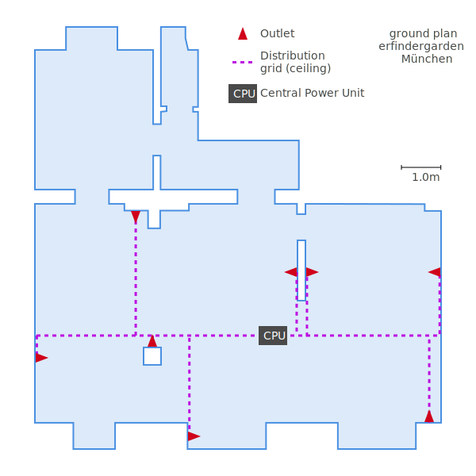

## Table of Contents

* TOC
{:toc}

---

## 2D Overview

**Goal: Know where to place everything in the room. Know how much wire is reqired in total.**

1. Vectorize a ground plan of the shop
2. Place outlets
3. Place CPU and routes
4. Perform some calculations

### 1. Vectorize a ground plan of the shop

The scan is a bit skewed so our first task is to transform it in GIMP. We want to have its edges paralell to the image borders and its angles square. First, i put four guide lines (blue dashed lines) onto my original scan, to indicate where the strokes of the drawing **should** be. Next, i use the *perspective* transform tool  to align all four corners in the drawing with the intersection points of the guides (red arrows). After adjusting one corner, i check if the other three corners still line up and adjust them in turn, until i'm statisfied with the result. It doesn't need to be too perfect…

<div class="row">
	<div class="col-sm-6">
		<zoom src="02-gimp-screenshot-1.png" shadow="true"></zoom>
	</div>
	<div class="col-sm-6">
		<zoom src="03-gimp-screenshot-2.png" shadow="true"></zoom>
	</div>
</div>

Now, export that file as `png`. The `jpeg` format is not recommended here, as the drawing might loose sharpness and edges could get fuzzy.

I prefer to vectorize this file manually for the cleaner svg output and as a further "filter" to smoothen out the imprecision of the scan. We could use Inkscape here, but for this simple task, [Sketch](https://www.sketchapp.com/) is totally fine and a bit easier to operate. So i start by adding my aligned png drawing as a layer in a blank Sketch file. Again, i add some guides to help me with the manual tracing.

<zoom src="04-sketch-guides.png"></zoom>

After that, i start drawing the outer shape of the relevant area in my plan as a  . Then i subtract the interior walls from that. Pretty simple if everything is straight.

<zoom src="06-sketch-interior.png"></zoom>

Finally, i need to take note of the scale. To achieve this, i draw a vector that has a known length in my plan, for example the `3.02m` at the bottom of the drawing. Then, i divide the length of that vector by our known 3.02, which gives me a line that represents exactly one meter in our original plan. Label

<zoom src="07-sketch-scale.png"></zoom>

Last thing i do is hide the background layer, resize the artboard and add a description. Done with the plan so far, now let's add our components to it!

<zoom src="08-sketch-ground-plan.png"></zoom>

<div class="alert alert-warning">
	<strong>What i could have done better:</strong> Measure the scale first and resize the drawing before vectorization so that for example <code>1px = 1cm</code>. This way, i could have used all measures stated on the scan to create an exact plan in easy-to-convert units. Realized too late, not necessary for now, lesson for next time…
</div>

### 2. Place outlets

I will set the locations of the outlets first, as they depend on our practical needs. The CPU location and wire routes have to be adapted to that.

The red triangle  indicates an outlet, but i made it a [Symbol](https://www.sketchapp.com/learn/documentation/symbols/) so i can change it any time. This way i also keep information about the orientation in the document. `0°` is the upwards pointing arrow. `-90°` points to the left. It is preserved in the svg as an attribute (`transform="rotate(-90.000000)"`) and might be useful in further, possibly automated steps.

The outlets are all placed in a common group called `Outlets`, which should also facilitate automated processing or evaluation.

<zoom src="10-sketch-outlets.png"></zoom>

### 3. Place CPU and routes

> "CPU" is a stupid acronym for the random term "Central Power Unit", which basically just means a power supply plus some analog electronics.

*Distribution grid* means wires at the ceiling, whose task is to distribute the power across the room to where it's needed – in contrast to the *Access grid*, which is a set of blank, vertically wall-mount copper strips where our DC can be tapped anywhere over the entire length.



What's missing now are the routes for the access grid. They go vertically upwards from each outlet to the respective end of the distribution grid - so they're pretty difficult to depict in our 2D top view. Let's go 3D!

### 4. Perform some calculations

<div class="alert alert-warning">Initially, the plan was to build a tool that could calculate some useful statistics, such as the total length of wire required, based on an svg plan and some more parameters using the <code>SVGGeometryElement.getTotalLength()</code> method. As i will build a small prototype section before installing the entire grid, such a tool is of less importance right now, given my limited time. But i still like the idea and will hopefully come back to it later.</div>

---

## 3D Components

I want to start with the design of the wall mounts for the access grid with its blank conductors. Everything should be nicely parametrized, so other people can easily adapt the system to their needs. For this reason, and because i know how to work with it already, [OpenSCAD](http://www.openscad.org/) will be the tool of my choice in the following steps.

The corresponding code to this section can be found at [https://github.com/fabgrid/design](https://github.com/fabgrid/design)

### 1. Acces Grid: Conductors

First, i will design the conductors as a module that provides the profile of the cross section over a standardized interface. This way, it can easily be swapped out later. This profile will then be used in the next step to determine the shape of the cutouts in the relevant parts of the wall-mount.

#### "Conductor" API:

A swappable software component needs a standardized interface. A "Conductor", as we use the term, must be a self-contained, "`use`-able" openSCAD file with the following module and functions:

```
ConductorProfile(current): [Module] Draws the profile of a single conductor on the XY-space
conductor_width(): [Function] Returns the X-spread of a single conductor
conductor_height(): [Function] Returns the Y-spread of a single conductor
```

The `current` argument to the `ConductorProfile` module is there to allow the conductor implementation to adjust its profile based on the electrical current that it's going to be loaded with.

#### Implementation: L-Conductor

As i currently imagine it, the first version will be made out of copper sheet metal, bent into an L-shape. Here's what the cross section looks like in openSCAD:

<zoom src="11-scad-l-profile.png"></zoom>

In a different file, i defined a helper module, to extrude any conductor profile into a 3D-shape, and another module that renders a series of them next to each other:

<zoom src="12-scad-conductor-3d.png"></zoom>

### 2. Acces Grid: Wall Mounts

Now that i have the shape of my conductors defined in a reusable way, i can now design suitable wall mounts based on that information. I will use the same schema, making the wall-mount a swappable component.

#### "Wall-Mount" API

The API for that is quite simple: Again, we need an openSCAD file providing a single module `WallMount` which draws an example of its type. It gets a single `$child` which is the full profile of the conductors.

And here's a first design draft:

<zoom src="13-scad-laser-wallmount.png"></zoom>

This model is just a draft, lacking the fitted joints. But it's already fully parametric and adapts to my conductors config. Shound i decide to use now 6 round wires, instead of 4 L-shaped ones, it automatically adapts:

<zoom src="14-scad-laser-wallmount-variant.png"></zoom>

#### Optimizations

One thing i need to find a solution for: I want to be able to separately open and render the files containing individual components (eg. `LaserWallMount`). Currently, they depend on `Main.scad` passing them the correct options. It would be nice to have everything stored in some kind of global config with known a interface (eg. variable names). This global config could then be used by all components to render with the correct options.

The code would be cleaner if we passed only the `ConductorsProfile` as child to the `WallMount` ([Main.scad:50](https://github.com/fabgrid/design/blob/master/Main.scad#L50)), instead of passing both the child *and* two arguments, `width` and `height`. Unfortunately, there is currently no way in openSCAD (without compiling a fork) to programatically retrieve the dimensions of a shape. Therefore, we have to rely on passing hard-coded or calculated values.

