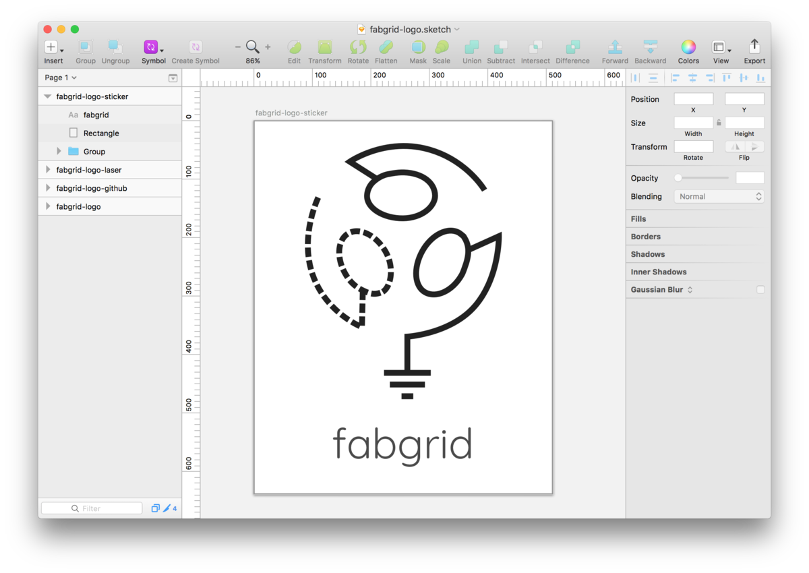
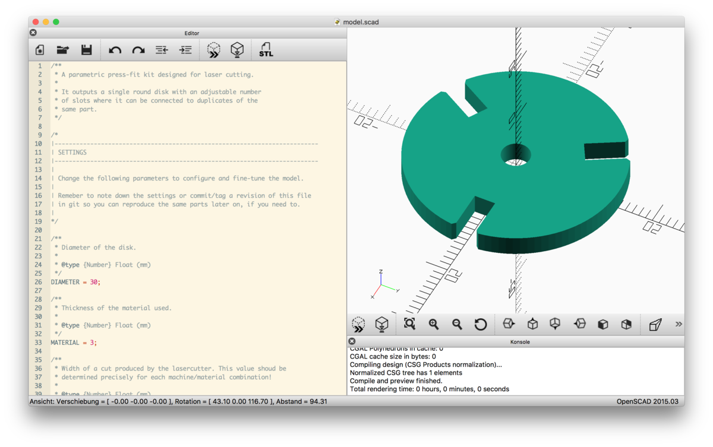
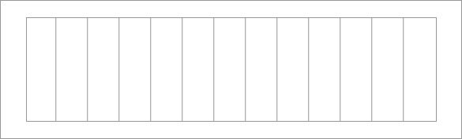
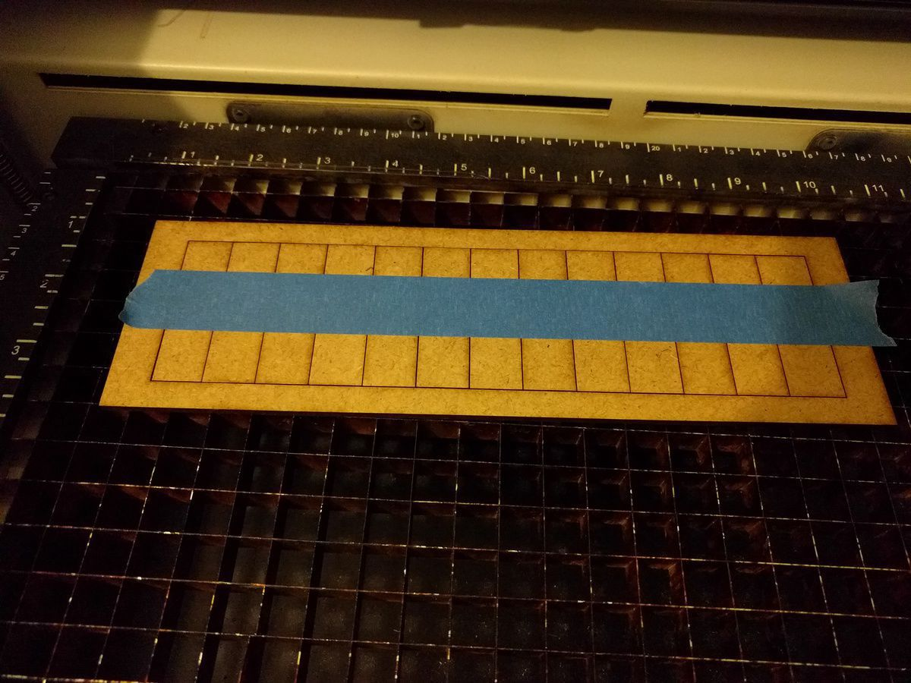
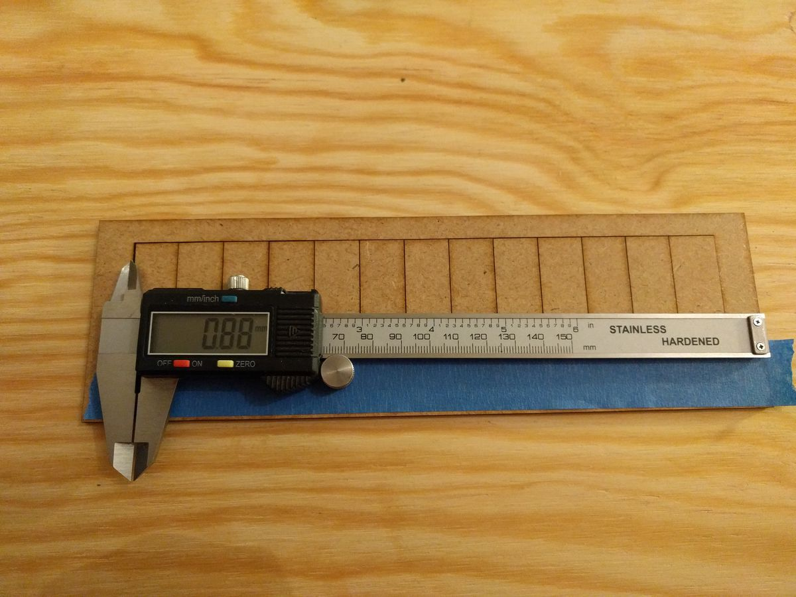
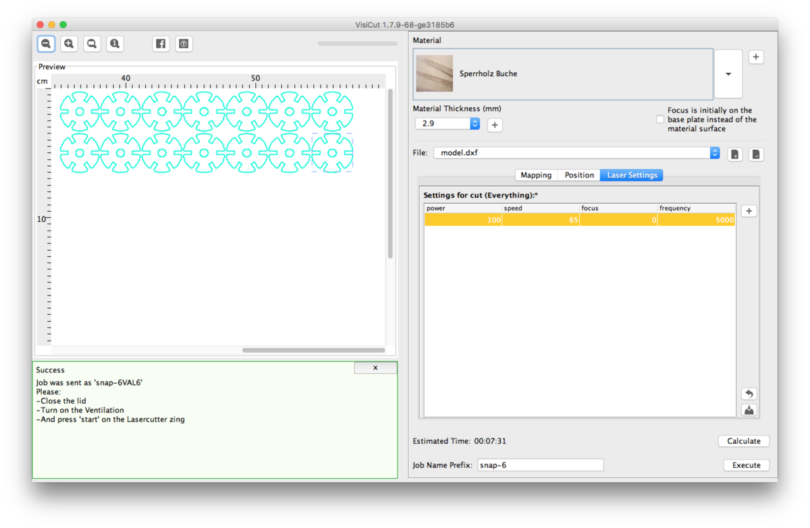
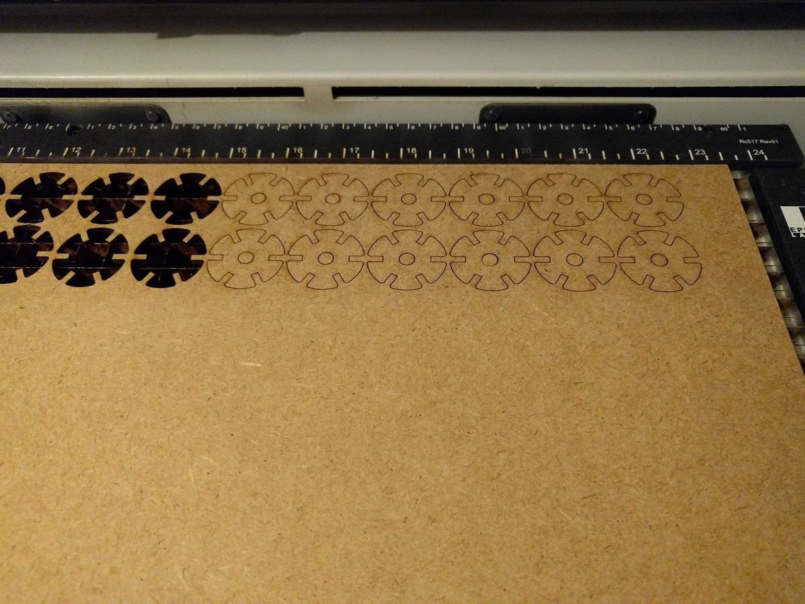
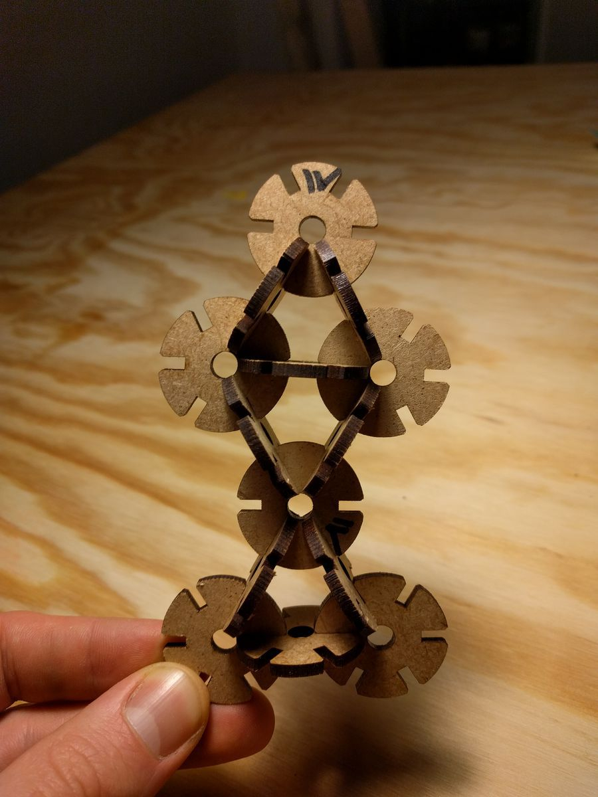
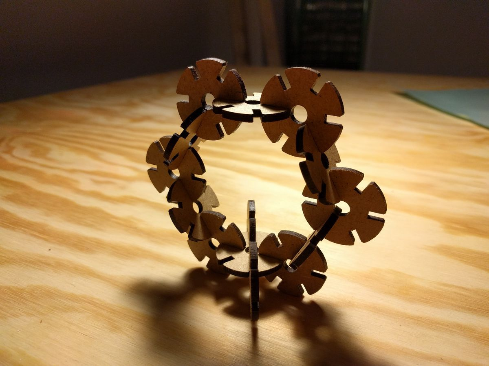

## Table of Contents

* TOC
{:toc}

---

## 1. Vinyl cutting

Before i can use the Vinyl cutter (a *Silhouette Cameo* in our lab), i need to download and install the control software called [Silhouette Studio](https://www.silhouetteamerica.com/software#update).

The design is simply gonna be the fabgrid logo as a vinyl sticker. I'll do it in Sketch, based on the already exising logo. A rectangular border is added so the sticker can later be easily removed from the rest of the vinyl.



I was told that the free version of Silhouette Studio couldn't open svg files. But it can open dxf, so i'm gonna save it as dxf using an Inkscape, tracing the outlines of all paths in the process.

---

## 2. Press-fit construction kit

First part will be to design a parametric press-fit construction kit for laser cutting, adjusting for the kerf.

### The Model

Again, i use openSCAD to design a fully parametric press-fit kit. The part itself is really simple: It's just a circular disk with a parametrized number of slots evenly distributed over its 360°. The type of slot used should be easily swappable. Separate values for clearance and lasercutter kerf let us fine-tune how tight the joints fit.

I end up with the following parameters:

```openscad
/**
 * Diameter of the disk.
 *
 * @type {Number} Float (mm)
 */
DIAMETER = 30;

/**
 * Thickness of the material used.
 *
 * @type {Number} Float (mm)
 */
MATERIAL = 3;

/**
 * Width of a cut produced by the lasercutter. This value shoud be
 * determined precisely for each machine/material combination!
 *
 * @type {Number} Float (mm)
 */
KERF = .05;

/**
 * Tolerance for joints. Should be a small value close to 0.
 * Very soft materials might require negative values.

 * @type {Number} Float (mm)
 */
CLEARANCE = .01;

/**
 * The number of slots in one disk.
 *
 * @type {Number} Integer
 */
N_SLOTS = 3;

/**
 * Depth of each slot. Mind that the total
 * overlap of two parts is twice as much.
 *
 * @type {Number} Float (mm)
 */
SLOT_DEPTH = 6;

/**
 * The type of slot to use.
 *
 * Options currently available:
 * 	- basic
 *
 * @type {String}
 */
SLOT_TYPE = "basic";

/**
 * The depth of the chamfer as fraction of `SLOT_DEPTH`.
 *
 * @type {Number} Float
 */
CHAMFER = .1;

/**
 * Diameter of the center hole. Set to 0 to disable.
 *
 * @type {Number} Float (mm)
 */
CENTER_HOLE = 4;

/**
 * Number of circle fragments per 360. Higher numbers
 * mean smoother circles. Can be set to `N_SLOTS`
 * or a multiple of it for fun effects.
 *
 * @type {Number} Integer
 */
FN = 100; //N_SLOTS*2;
```

The full source code can be found under the link at the top of this page (#Further Resources
). Above settings yield a part that looks like so:



### Measuring the kerf

Before we can cut the first sample of our model, we need to measure the kerf of the laser cutter/material combination using the following process:

1. Insert target material into the laser cutter
2. Adjust focus
3. Make a rectangular cut. Subdivide it into `n (n > 5)` segments
4. Compress the segments so all cutting edges touch, measure the total gap `g`
5. Our kerf can be calculated as `kerf = g/(n+1)`
6. The greater `n`, the more precise our measurement

This is the template:



I cut it on 2.9mm plywood, then use tape to hold everything together while taking it out of the cutter.



Three measurements are taken and averaged:



<math display="block">
	<mrow>
		<msub><mi>gap</mi><mi>total</mi></msub> <mo>=</mo> <mfrac><mrow><mn>0.82</mn> <mo>+</mo> <mn>0.88</mn> <mo>+</mo> <mn>0.72</mn></mrow><mrow><mn>3</mn></mrow></mfrac> <mo>≈</mo> <mn>0.8067</mn>
	</mrow>
</math>

The kerf is calculated as the above <math><msub><mi>gap</mi><mi>total</mi></msub></math> devided by the number of cuts. We can use that value as input parameter for our press-fit model:

<math display="block">
	<mrow>
		<mi>kerf</mi> <mo>=</mo> <mfrac><mrow><mn>0.82</mn> <mo>+</mo> <mn>0.88</mn> <mo>+</mo> <mn>0.72</mn></mrow><mrow><mn>3</mn> <mo>×</mo> <mn>14</mn></mrow></mfrac> <mo>≈</mo> <mn>0.0576</mn>
	</mrow>
</math>

### Cutting the parts

On the first attempt on cutting the parts, i had the settings in visicut to weak/fast (`power 100, speed 100`), so i had to cut another pass until the parts got loose. This distorts the kerf initially measured and results in the joint becoming too loose.

I made another attempt (`power 100, speed 75`), which was *almost good*, but the part still stuck a little bit. Thus the lower edges are not smooth. I'll give it another try at `power 100, speed 65` before i go into fine-tuning the clearance.

<iframe width="560" height="315" src="https://www.youtube.com/embed/hcEFxzhH-BA" frameborder="0" allowfullscreen class="constrain"></iframe>

This time i find the parts popping out well, so we can now start looking at and fine-tuning the fit of our joints. Looks like it'a bit too wide - the parts slip off each other easily. I add a clearance of <math><mrow><mo>-</mo></mrow><mrow><mfrac><mrow><mn>1</mn></mrow><mrow><mn>20</mn></mrow></mfrac></mrow><mrow><mi>mm</mi></mrow></math>. The resulting parts fit just right. Nice level of friction. I'll cut a couple of them with the same settings and see what i can build…

<div class="row">
	<div class="col-sm"></div>
	<div class="col-sm"></div>
</div>
<div class="row">
	<div class="col-sm"></div>
	<div class="col-sm"></div>
</div>

Pretty basic stuff so far and it takes lots of parts to build bigger structures. Should add bigger disks or elongated parts. Also, playing with the angle/number of slots would be interesting. Multiples of 4 as slots count would make it easy to create rectangular structures. Currently, with 6 slots, we're bound to 60° steps…

