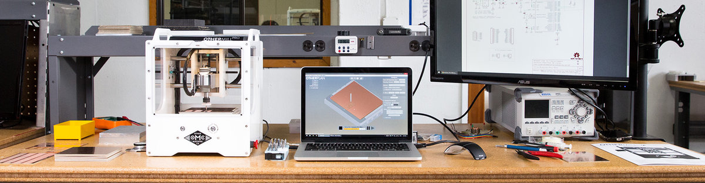

## Table of Contents

* TOC
{:toc}

---

## Milling the Board

Here at the erfindergarden, we have that nice little [Othermill](https://othermachine.co), which works perfectly for PCB milling. [Otherplan](https://othermachine.co/otherplan/), the software it comes with, is also optimized for pcb fabrication. First thing is to head to that link and upgrade the software.


<span class="img-caption">Photo from the othermachine.co website, showing the "Othermill" and corresponding software "Otherplan"</span>

### Generating the toolpaths

I decided to build the [FabTinyISP](http://fab.cba.mit.edu/classes/863.16/doc/projects/ftsmin/index.html) for its small footprint and low parts count. The board outline and traces are available on the linked website as 1000dpi PNGs. When browsing through [mod](http://mod.cba.mit.edu), i noticed that it can output Othermill-specific gcode, so let's check that feature out.

First, the traces need to be milled. Mod provides a preset for PCB traces with a 1/64" flat endmill. I use that and only change the number of offsets to `-1` in order to remove all copper that's not a trace or pad, then export as `Othermill (.nc)`. The resulting file can be directly read by Otherplan.

<div class="alert alert-warning">
	After breaking an end mill, i reduced the cut speed to 4.45mm/s. The actual reason was most likely my double-sided tape being too thick, so that the mill plunged too deeply into the material. This put too much stress on the tool, as it had to remove not only the copper plating, but also some of the FR-1 base material.
</div>

<div class="row">
	<div class="col-sm">
		<zoom src="02-mod-traces.png" caption="Processing the traces using fabmodules"></zoom>
	</div>
	<div class="col-sm">
		<zoom src="03-otherplan-traces.png" caption="GCode opened in Otherplan, ready to mill…"></zoom>
	</div>
</div>

#### Parameters changed in Mod:

- Offsets: -1
- Cut Speed: 4.45

#### Things to check in Otherplan

- Check Material, Size and Thickness
- Select proper tool (same as used in mod, 1/64")
- Physical position of the board inside the mill and position of the toolpaths inside Otherplan
- The tool can be inserted after starting the job. Otherplan will prompt you to insert the needed tool at the right time.
- When not using super-thin tape, add its thickness to the stock thickness parameter

After all settings in Otherplan are ensured to be correct, we stick the raw PCB onto the buildplate using double-sided tape. Make sure the surface is even and clean. Also make sure the PCB is flat. **Use the thinnest tape you can find!**

<div class="row">
	<div class="col-sm">
		<zoom src="04-pcb-tape.jpg" shadow="true"></zoom>
	</div>
	<div class="col-sm">
		<zoom src="05-pcb-inserted.jpg" shadow="true"></zoom>
	</div>
</div>

I didn't have any of the super-thin tape so i used a thicker one, causing the tool to break. So on the second attempt, i reduced cut speed in mod, and added the approximate tape thickness to the material thickness (z = 1.60mm) in Otherplan.

This time the traces come out nicely:

<div class="row">
	<div class="col-sm">
		<zoom src="06-traces-done.jpg" shadow="true"></zoom>
	</div>
	<div class="col-sm">
		<iframe class="constrain" width="560" height="315" src="https://www.youtube.com/embed/kywhPTGDRKE" frameborder="0" allowfullscreen></iframe>
	</div>
</div>

#### Outline

The process for the outline is quite similar, with just a few differences:

- In mod, use the "PCB outline (1/32)" profile and keep all suggested parameters
- Use a 1/32" bit

An here's how it looks:

<iframe class="constrain" width="560" height="315" src="https://www.youtube.com/embed/vbv0GNLJU2Q" frameborder="0" allowfullscreen></iframe>

<div class="alert alert-info">
	Towards the end of the cutting process, one can see a white blob building up around the mill. It's the sticky tape wrapping around. The toolpaths could be adjusted to not cut all the way down and avoid this, as it might influence the performace/lifetime of the bit.
</div>

#### Final steps

- Clean the PCB and mill with a vacuum cleaner
- Carefully remove the board with a knife or sharp screwdriver
- Clean board with water and soap or alcohol

<zoom src="07-finished-pcb.jpg" shadow="true"></zoom>

## Collecting the components

- Collect parts on tape
- Have no 49Ω, use 100Ω
- Have no 100nF, use a 1uF
- Have only one 3v3 zener, salvage another board…
- LEDs: yellow and blue instead of green and red - resistors should still match approximately

<zoom src="08-components-sheet.jpg" shadow="true"></zoom>

## Solder

- Have the layout and schematic open on a screen or printed out for quick lookup
- Small components first for easy access to all solder pads
- ISP header before ATTiny because of heat

Then, for each component:
- Always have a clean tip with a little solder on it
- Put some solder on the pad
- Place part, ensure orientation, fix it at one pin
- Solder other pin(s)
- Re-solder "fixture pin"

I first did the resistors, z-diodes and the capacitor next to the USB plug, then the LEDs and their series resistors, then the ATTiny and finally the ISP header. Everything was easily accessible to solder.

<zoom src="09-soldered-pcb.jpg" shadow="true"></zoom>

## Check Board

Now we do a few checks before we power up the board for the first time.

1. Visually check each part against the schematic (position, orientation)
2. Visually check for unwanted solder bridges
3. Ensure there's no short between VCC and GND using a multimeter
4. Close solder jumper
5. Plug into usb and see if red LED lights up

## Flash

### Prepare environment (macOS)

- Install [Crosspack](https://www.obdev.at/products/crosspack/download.html)
- Crosspack didn't put a `gcc-avr` binary into my $PATH, so i installed it manually using `brew tap osx-cross/avr; brew install avr-libc`
- avrdude is also missing so i'll install that as well: `brew install avrdude`
- I think we could have left crosspack out as its only purpose was to install those two binaries and their dependencies, which homebrew did easily. Crosspack hasn't been updated in a couple of years, maybe it's not even necessary anymore…


### Flash in stages

- Download and `make` the [firmware](http://fab.cba.mit.edu/classes/863.16/doc/projects/ftsmin/fts_firmware_bdm_v1.zip)
- Connect the board to an ISP programmer
- `make flash` the firmware to the board
- `make fuses` to set the fuses except the one disabling the reset pin
- Plug into usb and check if the device gets recognized (on macOS use "System Information" app if there's no `lsusb`)
- **Only after ensuring the device gets recognized:** [Blow the reset fuse ;)](https://www.youtube.com/watch?v=8v_Hv-lN1yE) – `make rstdisbl`, enabling the board to act as a programmer itself
- Open the solder jumper again. Use solder wick to remove the excess solder.

<div class="row">
	<div class="col-sm">
		<zoom src="10-isp-cable.jpg" shadow="true" caption="Pin 1 is top left"></zoom>
	</div>
	<div class="col-sm">
		<zoom src="11-sysinfo.png" caption="Make sure USBtinySPI is there!"></zoom>
	</div>
</div>

## Tune thickness

- We need to ensure proper contact of the USB plug – the PCB itself is too thin
- Cut out the shape from an old credit card or something and glue it to the bottom of the board

<zoom src="12-extra-thickness.jpg" shadow="true"></zoom>

## Program something!

> Or rather: Try to program something; Fail; Debug; Look at and understand the circuit you just built; And then, program something!

- Now i want to test my programmer, so i'll breadboard a simple test circuit with another ATTiny and an LED to flash the "Blink LED" sketch onto it using the Arduino IDE. (Photo breadboard)
- Check the pinout in the [Datasheet](http://www.atmel.com/images/atmel-2586-avr-8-bit-microcontroller-attiny25-attiny45-attiny85_datasheet.pdf) and connect accordingly (i used another breadboard for this purpose): (screenshot) (photo)
- Conncet in through a USB-2.0 hub, as USBv3 might cause trouble
- Check connection using `avrdude -p attiny45 -c usbtiny -v`
- Gives error

```
initialization failed, rc=-1
         Double check connections and try again, or use -F to override
         this check.
```

- Online research indicates this error is due to a hardware issue
- Connecting the breadboard to my known-to-work programmer lets me program the ATTiny, proving that the chip and wiring are okay. Must be a physical issue with my board…
- One last check could be to try to use it from a linux machine with native USB 2.0
- Unfortunately i have no suitable computer at hand right now. And also my multimeter ran out of power with no 9V block at hand so i'll have to debug the issue later in the lab…

The solution:

- When i got the multimeter going, first thing i checked was whether GND and VCC on the ICSP header were connected to the USB plug. GND was, VCC was not. So i looked at the traces again and realized: The solder jumper was open in order to program devices that have their own power supply. I was assuming that the programmer would power my chip, but it's configured to *do not*.
- So i decided to give the ATTiny its own power supply by switching back to the original test breadboard with the led, using the Adafruit PowerBoost with a small LiPo battery mounted there – Tada! It worked!

```
$ avrdude -p attiny45 -c usbtiny

avrdude: AVR device initialized and ready to accept instructions
Reading | ################################################## | 100% 0.00s
avrdude: Device signature = 0x1e9206 (probably t45)
avrdude: safemode: Fuses OK (E:FF, H:DF, L:E2)
avrdude done.  Thank you.
```

Note: Now i also understood what the green LED is for: It lights up when the powered ATTiny is connected, indicating that we're ready to flash.

Time to flash the "hello world" *Blink Sketch*. Inside the Arduino IDE (with the ATTiny toolchain installed), i open up the "Example > Basics > Blink" sketch and replace all three occurences of the `LED_BUILTIN` constant with the value `0`. This refers to PB0 on the ATTiny, where the LED is connected.

(screenshot)

Note: Had i asked myself what the purpose of the *VCC jumper* on my working programmer is, i could have realized the issue earlier…


